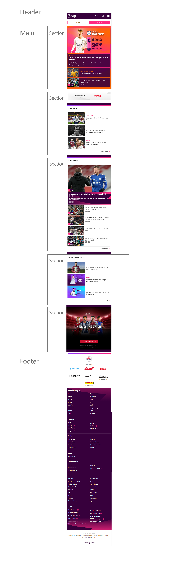
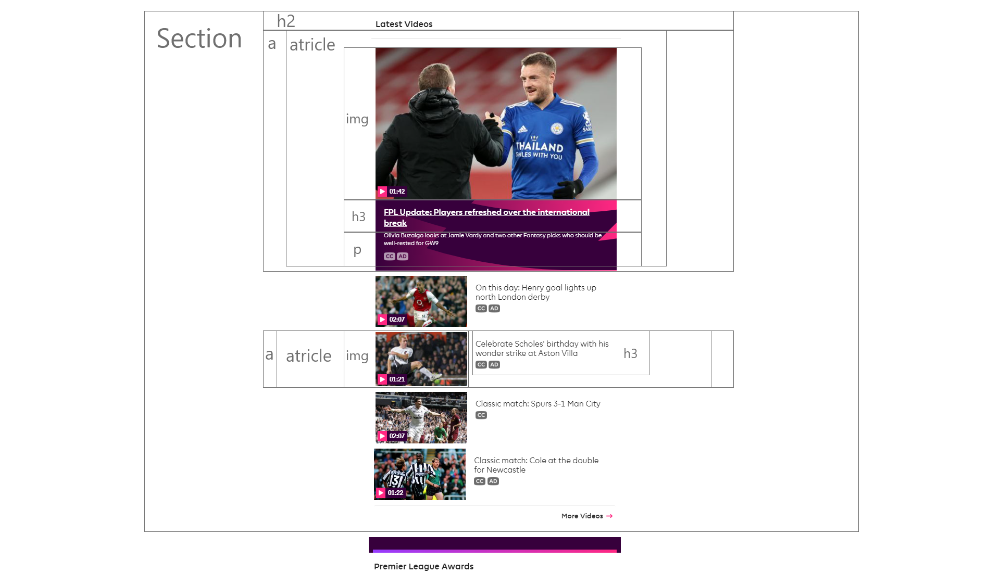
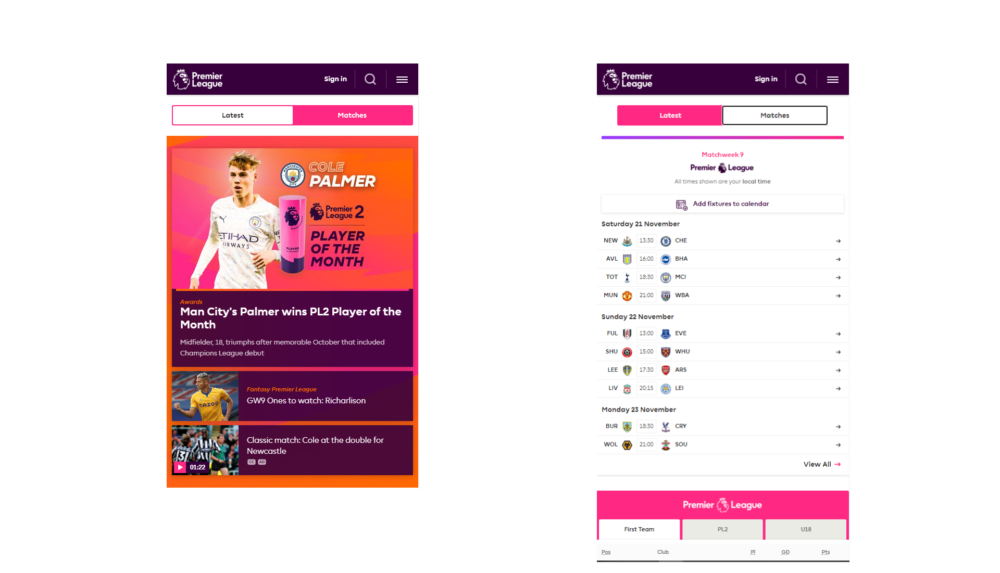

# Procesverslag
**Auteur:** -Gerrit de Keijzer-

Markdown cheat cheet: [Hulp bij het schrijven van Markdown](https://github.com/adam-p/markdown-here/wiki/Markdown-Cheatsheet). Nb. de standaardstructuur en de spartaanse opmaak zijn helemaal prima. Het gaat om de inhoud van je procesverslag. Besteedt de tijd voor pracht en praal aan je website.

## Bronnenlijst
1. -bron 1-
2. -bron 2-
3. -...-

## Eindgesprek (week 7/8)

-dit ging goed & dit was lastig-

**Screenshot(s):**

-screenshot(s) van je eindresultaat-

## Voortgang 3 (week 6)
| Denzel | Gerrit | Jessie  | Cesar |
| --- | --- | --- | --- | --- |
|slimme selectoren |meerdere navs|Background-image|winkelmandje|
|css |lists|meerdere full screen images|responsive, resolutie|
|fonts|svg|hamburger menu|carousel|

## Voortgang 2 (week 5)

opnieuw begonnen met website, omdat m'n code een puinhoop was. 
ik heb nu een systeem gecreeerd waarin ik mijn gewenste effect.
namelijk een main met daarin 2 divs waarvan 1 verborgen. de tabs kunnen gebruikt worden om te navigeren tussen de twee pagina's

## Voortgang 1 (week 3)

### Stand van zaken

feedbacksessie:
eventueel svg gebruiken voor de achtergond
css peeper extensievoor huisstijl
hoeft niet alles uit te werken

het maken van de opdrachten verliep prima. ik herkans deze periode ook programmeren dus ben al een tijdje bezig geweest

**Screenshot(s):**

ik moet nog beginnen met mijn eindopdracht

### Agenda voor meeting

| Denzel | Gerrit | Jessie | Micky | Cesar |
| --- | --- | --- | --- | --- |
|Selectoren |De dingen die ik wil uitwerken|Background-image|Breakdown schetsen|Desktop V1 ipv Telefoon V1|
|Navigatie |De uitbreiding naar responsive|Transitions tussen fixed en relative header op scrol|Flexbox|Alle content?|
|Orginele website aanpassen|Hoe neem ik huisstijl over|svg image|Lettertypes|Image size, Voorbeeld vorig jaar|

### week 2
elementen houden geen rekening met absolute elementen, absolute = uit de flow

### Verslag van meeting

-elke section en article moet een heading bevatten, want dan is het te begrijpen voor google en text to speech (voor slechtzienden)
a = link naar andere pagina, button blijft op dezelfde pagina, link naar section op dezelfde pagina wel een link (a)
articles in een sectie in plaats van ul 
webdeveloper tools vor controle!
css structuur volgt html-

## Breakdownschets (week 1)

## Intake (week 1)
-uitwerken voor de kick-off werkgroep - begin van de eerste week-

**Je startniveau:**  rood 

**Je focus:** responsive

**Je opdracht:** https://keijzeg.github.io/blokweb/

**Screenshot van de website (small screen):**

